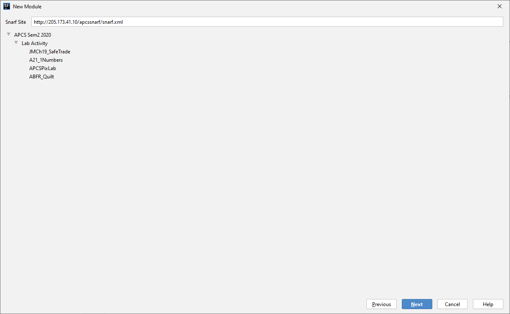
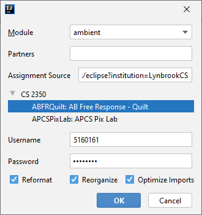
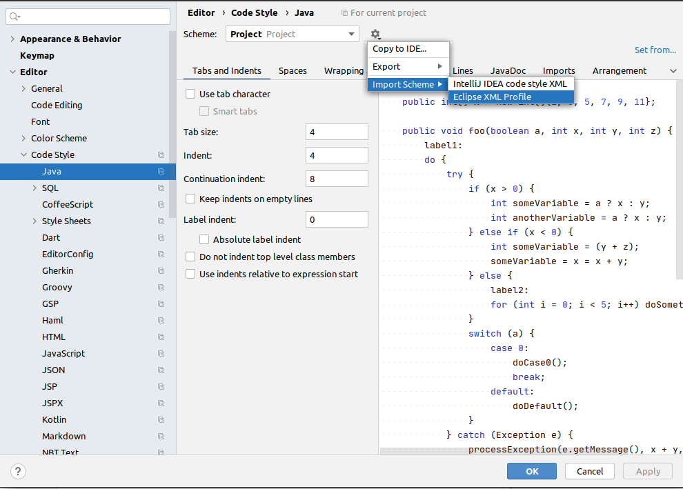

# ambient 
A plugin for IntelliJ that enables assignment import and submission

Written with Kotlin, designed with Java + IntelliJ Form Designer. Build orchestrated by Gradle.

To start helping with the plugin, just start editing the source files.
To test the plugin, run `./gradlew runIde`, which will launch IntelliJ Community Edition with the version specified in `build.gradle.kts`.

The plugin will automatically be published upon merge to `master` by GitHub actions.

## How to Use Ambient
### Snarfing
You can snarf by getting the URL for your snarf site and then pasting it into the field in the File > New > Module dialog.

### Submitting to WebCAT
Get your submission URL from Home > My Profile > Personalized Service URLs. Copy the URL from Eclipse, and paste that into the assignment source field of the Tools > Submit Assignment Dialog.

## Code Formatting for WebCAT
WebCAT likes its code to be formatted in a special way. To replicate this in IntelliJ, [download this gist here](https://gist.github.com/Neragin/98e569dfc561622f5b3227287570d3c7#file-vtcsformatter-xml). Then, go into File > Settings > Editor > Code Style > Java. From there, click the gear icon > Import Scheme > Eclipse XML Profile. Make sure to select the vtcsformatter.xml you downloaded, and press apply.
 
